# OctoBankX — Product Document

**כספת** (Kasefet) — Automated Bank Statement Download & Management Platform

---

> **Version:** 2.0  
> **Date:** May 2026  
> **Platform:** Ruby / Sinatra Web Application

---

## Table of Contents

1. [Executive Summary](#1-executive-summary)
2. [Problem Statement](#2-problem-statement)
3. [Solution Overview](#3-solution-overview)
4. [Feature Summary](#4-feature-summary)
5. [Technology Stack](#5-technology-stack)
6. [Architecture](#6-architecture)
7. [Database Schema](#7-database-schema)
8. [User Interface — Desktop](#8-user-interface--desktop)
9. [User Interface — Mobile](#9-user-interface--mobile)
10. [REST API](#10-rest-api)
11. [Background Jobs & Scheduling](#11-background-jobs--scheduling)
12. [Internationalization](#12-internationalization)
13. [Supported Banks](#13-supported-banks)
14. [Configuration](#14-configuration)

---

## 1. Executive Summary

OctoBankX (כספת) is a full-stack web platform that automates the daily download of bank statement files from multiple Israeli financial institutions via Secure FTP. It replaces error-prone manual processes with a reliable, auditable, automated workflow.

**Key capabilities:**

- Automated daily SFTP downloads with retry logic
- Real-time monitoring dashboard with charts and metrics
- Full audit trail of every download attempt
- Per-bank file parser and column-mapping configuration
- Responsive mobile web interface
- RESTful JSON API for integration with ERP/BI systems
- Full Hebrew and English bilingual support with RTL layout

---

## 2. Problem Statement

Organizations managing multiple bank accounts across several Israeli banks face daily operational challenges:

| Challenge | Impact |
|-----------|--------|
| **Manual daily downloads** | Finance staff spend 45–90 minutes/day logging into bank SFTP servers and downloading files |
| **Inconsistent file handling** | File naming, folder structure, and saving procedures vary between employees |
| **No audit trail** | No record of what was downloaded, when, or by whom |
| **Silent failures** | A failed download may not be discovered until the data is missing in accounting |
| **Scalability issues** | Adding a new bank or account requires new procedures and staff training |

---

## 3. Solution Overview

OctoBankX automates the entire workflow:

```
                     ┌─────────────────────────────────┐
                     │           OctoBankX              │
   ╔═══════════╗     │  ┌──────────┐  ┌─────────────┐  │     ╔══════════════╗
   ║  Bank     ║────▶│  │ Download │  │   Status    │  │────▶║  ERP / BI /  ║
   ║  SFTP     ║     │  │   Job    │  │  Tracking   │  │     ║  Accounting  ║
   ╚═══════════╝     │  └──────────┘  └─────────────┘  │     ╚══════════════╝
                     │  ┌──────────────────────────┐   │
                     │  │   Web UI + Mobile + API  │   │
                     │  └──────────────────────────┘   │
                     └─────────────────────────────────┘
```

**Value delivered:**

| Metric | Before OctoBankX | With OctoBankX |
|--------|------------------|----------------|
| Daily download effort | 45–90 min/day | 0 min (fully automated) |
| Failure detection time | Hours to days | Immediate (email + dashboard) |
| Audit coverage | Partial | 100% |
| Adding a new bank | New procedures + training | Fill a form in the UI |
| Data availability for processing | Hours of delay | Automatic — ready by 06:00 |

---

## 4. Feature Summary

### Core Features

| Feature | Description |
|---------|-------------|
| **Bank Management** | Register banks with SFTP connection details, parser assignment, column-mapping ruler, and target folder |
| **Automated Downloads** | Cron-scheduled daily SFTP download for all registered banks |
| **Email Listener** | Monitors a dedicated inbox (IMAP/POP3) for incoming statement files from approved senders |
| **Email Sender Management** | Maintain a list of approved email addresses with per-bank association and active/inactive status |
| **Download Lifecycle** | Full status tracking: `pending → running → success / failed` |
| **Retry Logic** | Configurable automatic retry on failure |
| **File Parsing** | Pluggable parsers (Leumi, Poalim, Discount, FIBI) with configurable column rulers |
| **Error Reporting** | Detailed error capture per download with email alerts |
| **Audit Trail** | Complete history of every download attempt with 90-day retention |

### Interface Features

| Feature | Description |
|---------|-------------|
| **Dashboard** | Summary cards, weekly activity chart, status breakdown doughnut, recent downloads table |
| **Jobs Page** | Real-time download status with date and status filters |
| **Log Page** | Full history with multi-criteria filters (bank, status, date range) |
| **Settings Page** | System-wide configuration editor |
| **Email Senders Page** | Manage approved email senders with bank association and active/inactive toggles |
| **Mobile Interface** | Fully responsive mobile layout at `/mobile/` |
| **Bilingual UI** | English and Hebrew with full RTL support |

### API Features

| Feature | Description |
|---------|-------------|
| **Downloads API** | List, create, and update download records via JSON |
| **Status API** | System health snapshot endpoint |
| **Pagination** | Configurable `limit` and `offset` for all list endpoints |

---

## 5. Technology Stack

| Component | Technology | Version |
|-----------|-----------|---------|
| **Language** | Ruby | 3.4 |
| **Web Framework** | Sinatra | 4.0 |
| **HTTP Server** | Puma | 6.x |
| **ORM** | Sequel | 5.87 |
| **Database** | SQLite3 | 2.5 |
| **SFTP** | Net::SFTP + Net::SSH | 4.0 / 7.x |
| **Email** | Net::IMAP + Net::POP + Mail | 0.5 / 0.1 / 2.8 |
| **Scheduler** | Rufus-Scheduler | 3.9 |
| **Internationalization** | i18n | 1.14 |
| **Testing** | RSpec + Rack::Test + FactoryBot | 3.13 |
| **Charts** | Chart.js | 4.x |

---

## 6. Architecture

```
┌─────────────────────────────────────────────────────────────────┐
│                     Client Layer                                │
│   ┌──────────────────┐    ┌──────────────────┐                  │
│   │  Desktop Browser │    │  Mobile Browser  │                  │
│   └────────┬─────────┘    └────────┬──────────┘                 │
│            └──────────┬────────────┘                            │
└───────────────────────┼────────────────────────────────────────┘
                        │ HTTP
┌───────────────────────┼────────────────────────────────────────┐
│              Application Layer (Sinatra + Puma)                │
│   ┌────────────┐  ┌─────────────┐  ┌─────────────────┐        │
│   │ Web Routes │  │ API Routes  │  │ Mobile Routes   │        │
│   │ /          │  │ /api/v1/*   │  │ /mobile/*       │        │
│   └─────┬──────┘  └──────┬──────┘  └────────┬────────┘        │
│         └────────────────┼──────────────────┘                  │
│   ┌──────────────────────▼───────────────────────┐             │
│   │           Business Logic                      │             │
│   │  DownloadJob (enqueue + execute)              │             │
│   │  EmailListenerJob (IMAP/POP3 inbox monitor)    │             │
│   │  SftpHelper (Net::SFTP wrapper)               │             │
│   │  Parsers (Leumi, Poalim, Discount, FIBI)      │             │
│   └──────────────────────┬───────────────────────┘             │
│   ┌──────────────────────▼───────────────────────┐             │
│   │        Sequel ORM Models                      │             │
│   │  Bank · Download · Setting · EmailSender      │             │
│   └──────────────────────────────────────────────┘             │
│   ┌──────────────────┐                                         │
│   │ Rufus Scheduler  │  (cron-based daily job trigger)         │
│   └──────────────────┘                                         │
└────────────────────────────────────────────────────────────────┘
                        │
┌───────────────────────┼────────────────────────────────────────┐
│              Data & Infrastructure Layer                       │
│   ┌────────────────────┐  ┌───────────────────────┐            │
│   │  SQLite Database   │  │   File System         │            │
│   │  (octobankx.db)    │  │  /downloads/{bank}/   │            │
│   └────────────────────┘  └───────────────────────┘            │
│   ┌─────────────────────────────────────────────────┐          │
│   │          Bank SFTP Servers                      │          │
│   │  sftp.leumi.co.il · sftp.bankhapoalim.co.il    │          │
│   │  sftp.discountbank.co.il · sftp.fibi.co.il     │          │
│   └─────────────────────────────────────────────────┘          │
│   ┌─────────────────────────────────────────────────┐          │
│   │          Email Inbox (IMAP/POP3)                │          │
│   │  kassefet-server@gmail.com                      │          │
│   └─────────────────────────────────────────────────┘          │
└────────────────────────────────────────────────────────────────┘
```

---

## 7. Database Schema

### `banks`

Stores SFTP connection details and parsing configuration for each financial institution.

| Column | Type | Notes |
|--------|------|-------|
| `id` | integer | Primary key |
| `name` | string | Unique, required |
| `sftp_host` | string | Required |
| `sftp_port` | integer | Default: 22 |
| `sftp_remote_path` | string | Default: `/` |
| `sftp_username` | string | SFTP login |
| `sftp_password` | string | SFTP password |
| `ruler` | text | Column mapping rules for file parsing |
| `parser` | string | Parser class name (e.g. `LeumiParser`) |
| `target_folder` | string | Local destination folder |
| `created_at` | datetime | |
| `updated_at` | datetime | |

### `downloads`

One record per bank per day; tracks the full lifecycle of each statement download.

| Column | Type | Notes |
|--------|------|-------|
| `id` | integer | Primary key |
| `bank_id` | integer | Foreign key → `banks.id`, required |
| `date` | date | Statement date, required |
| `status` | string | `pending` / `running` / `success` / `failed` |
| `error_message` | string | Populated on failure |
| `file_path` | string | Local path to downloaded file on success |
| `started_at` | datetime | When the SFTP transfer began |
| `completed_at` | datetime | When the transfer finished |
| `created_at` | datetime | |

**Download lifecycle:**

```
[created] → pending → running → success
                              ↘ failed
```

### `settings`

Key-value store for system-wide configuration.

| Column | Type | Notes |
|--------|------|-------|
| `id` | integer | Primary key |
| `key` | string | Unique, required |
| `value` | string | |
| `description` | string | Human-readable hint |
| `updated_at` | datetime | |

### `email_senders`

Maintains the list of approved email addresses from which the system accepts incoming statement files.

| Column | Type | Notes |
|--------|------|-------|
| `id` | integer | Primary key |
| `sender_name` | string | Descriptive label, required |
| `sender_email` | string | Unique email address, required |
| `bank_id` | integer | Foreign key → `banks.id` (cascade delete) |
| `active` | boolean | Default: `true` |
| `created_at` | datetime | |
| `updated_at` | datetime | |

---

## 8. User Interface — Desktop

### Dashboard

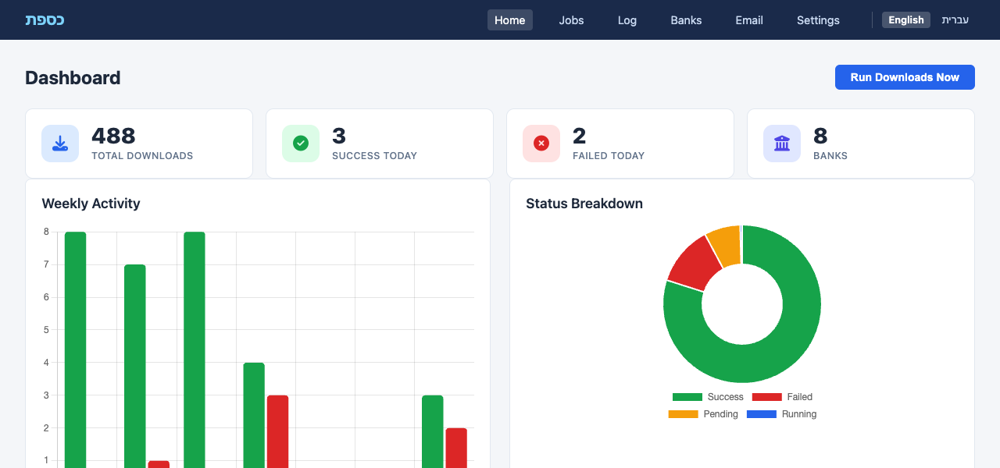

The dashboard provides at-a-glance system health: summary metric cards, a 7-day activity bar chart, status distribution doughnut chart, and a table of the 10 most recent downloads. The **Run Downloads Now** button allows manual triggering.

### Banks

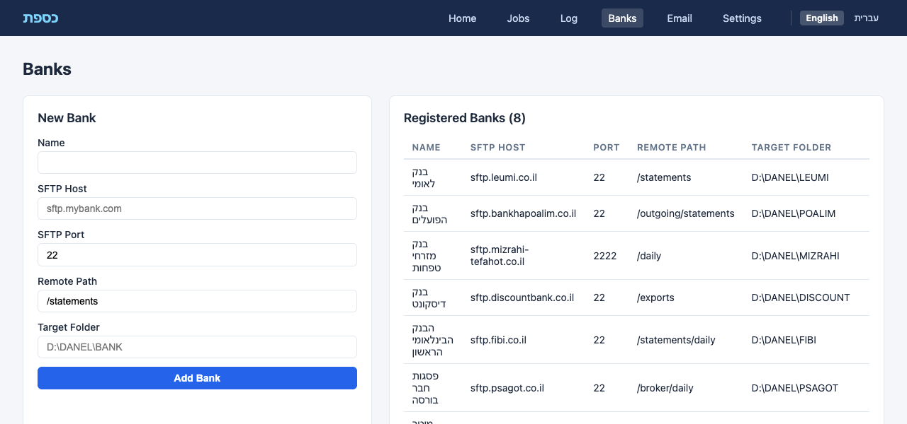

The banks page displays all registered banks in a table with SFTP details, ruler configuration, parser assignment, and target folder. A **New Bank** form allows adding banks with full configuration.

### Jobs

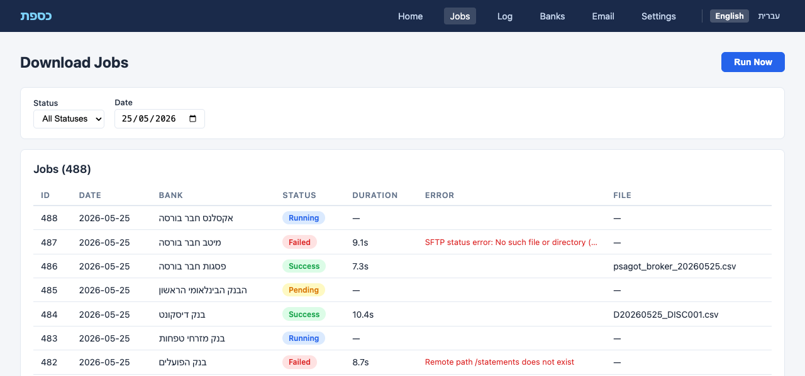

Real-time view of download jobs with status and date filters. Each row shows the bank, date, status badge, error message (if failed), file path (if successful), and timing information.

### Log

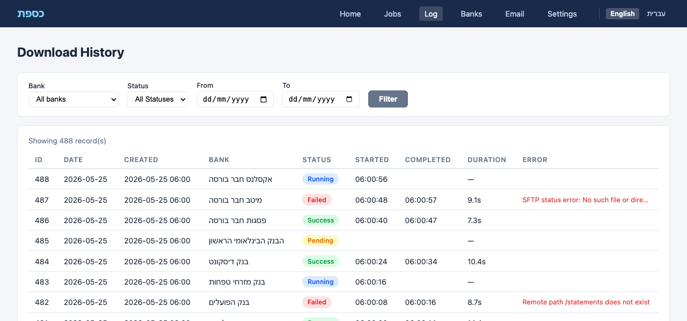

Full download audit trail with multi-criteria filtering: bank, status, and date range. Supports up to 500 records per view, ordered most-recent-first.

### Settings

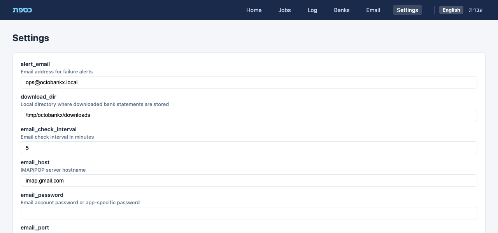

System-wide configuration editor for download directory, SFTP timeout, cron schedule, retry count, alert email, notification preferences, and data retention period.

### Email Senders

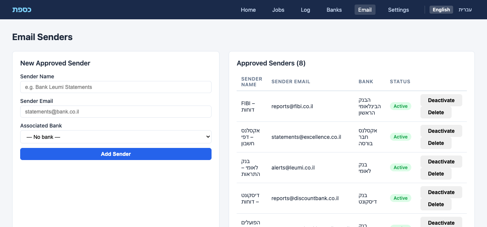

Manage approved email addresses for incoming statement files. Each sender is linked to a bank, can be toggled active/inactive, or deleted. A form allows adding new senders with email, name, and bank association.

---

## 9. User Interface — Mobile

OctoBankX provides a fully responsive mobile interface at `/mobile/`, optimized for smartphones.

### Mobile Dashboard

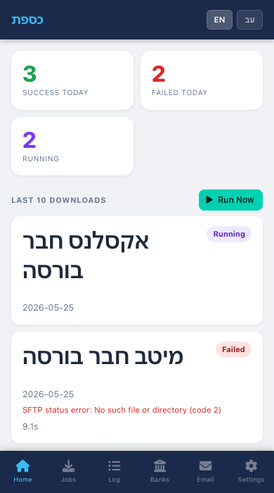

Compact summary counters and scrollable download card list.

### Mobile Banks

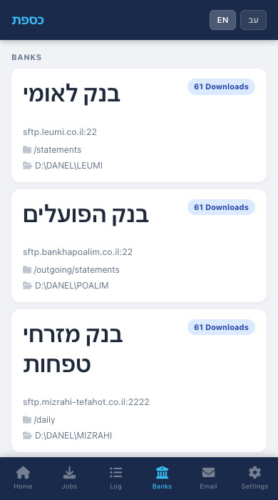

Bank cards with SFTP details and inline registration form.

### Mobile Jobs

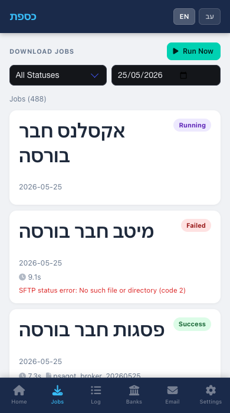

Compact card-based job list with status and date filters.

### Mobile Log

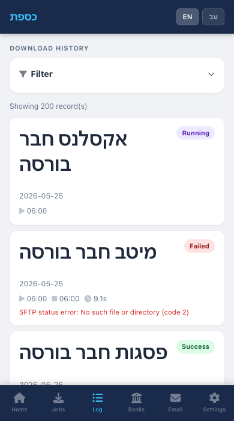

Scrollable log with filter controls at the top.

### Mobile Settings

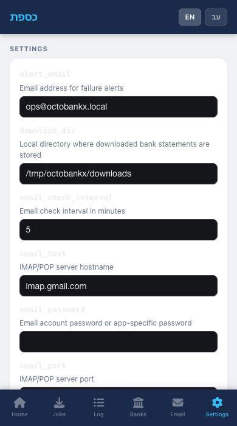

Mobile-optimized settings form with **Switch to Desktop Version** link.

### Mobile Email Senders

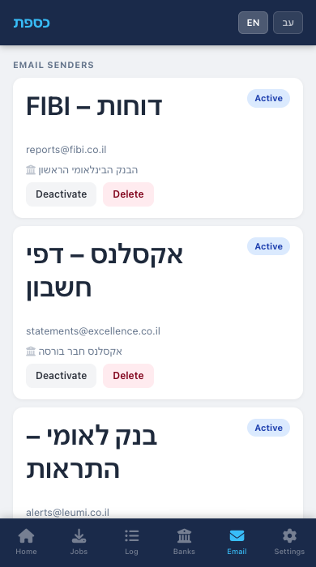

Card-based view of approved email senders with inline activate/deactivate and delete actions, plus an expandable form to add new senders.

---

## 10. REST API

All API endpoints are under `/api/v1`. Responses are JSON (`Content-Type: application/json`).

### Downloads

| Method | Endpoint | Description |
|--------|----------|-------------|
| `GET` | `/api/v1/downloads` | List downloads (filterable by `status`, `bank_id`, `date`; supports `limit`/`offset`) |
| `GET` | `/api/v1/downloads/:id` | Get a single download record |
| `POST` | `/api/v1/downloads` | Enqueue a download for a specific bank and date |
| `PATCH` | `/api/v1/downloads/:id/status` | Update download status (`running`, `success`, `failed`) |

### System Status

| Method | Endpoint | Description |
|--------|----------|-------------|
| `GET` | `/api/v1/status` | System health snapshot: total counts, today's counts, last success/failure info |

### Example Response — GET /api/v1/downloads

```json
[
  {
    "id": 42,
    "bank_id": 2,
    "bank_name": "בנק לאומי",
    "date": "2026-05-25",
    "status": "success",
    "error_message": null,
    "file_path": "/downloads/leumi/leumi_20260525_main.csv",
    "started_at": "2026-05-25T06:00:01Z",
    "completed_at": "2026-05-25T06:00:04Z",
    "duration_s": 3.12,
    "created_at": "2026-05-25T06:00:00Z"
  }
]
```

---

## 11. Background Jobs & Scheduling

### DownloadJob

The daily job has two phases:

**Phase 1 — Enqueue:** For every bank in the system, creates a `Download` record with `status: 'pending'` for the given date. Banks that already have a download record for that date are skipped (idempotent).

**Phase 2 — Execute:** Processes all `pending` records:

1. Sets `status = 'running'` and stamps `started_at`
2. Connects to the bank's SFTP server via `SftpHelper`
3. Downloads the statement file
4. On success: sets `status = 'success'`, stores `file_path`, stamps `completed_at`
5. On failure: sets `status = 'failed'`, stores `error_message`, stamps `completed_at`

### Schedule

The scheduler runs via `rufus-scheduler` in `config.ru`. The cron expression defaults to `0 6 * * *` (every day at 06:00), configurable via the `JOB_SCHEDULE` environment variable or the `job_schedule` setting.

### EmailListenerJob

The email listener job monitors a dedicated inbox for incoming statement files from approved senders:

1. Connects to the configured email server via IMAP or POP3
2. Retrieves unread messages
3. For each message, checks whether the sender's address is in the `email_senders` table and is active
4. If approved, extracts all CSV/Excel/ZIP attachments
5. Saves attachments to the associated bank's download directory
6. Creates a `Download` record with `status: 'success'`
7. Marks the email as read (IMAP) or deletes it (POP3)

The job runs at the interval specified by `email_check_interval` (default: 5 minutes).

### Manual Triggers

- **Web UI:** Click **Run Downloads Now** on the Dashboard or Jobs page
- **CLI:** `bundle exec rake jobs:run`
- **API:** `POST /api/v1/downloads` to enqueue a single bank

---

## 12. Internationalization

OctoBankX supports two languages:

| Language | Locale | Layout |
|----------|--------|--------|
| English | `en` | LTR (left-to-right) |
| Hebrew (עברית) | `he` | RTL (right-to-left) |

### Hebrew Interface Examples


All UI labels, navigation items, status badges, flash messages, and form fields are fully translated. The layout automatically switches to RTL when Hebrew is selected.

---

## 13. Supported Banks

OctoBankX comes pre-configured with 8 Israeli financial institutions:

### Banks

| Bank | Parser | File Pattern |
|------|--------|-------------|
| בנק לאומי (Bank Leumi) | `LeumiParser` | `leumi_YYYYMMDD_main.csv` |
| בנק הפועלים (Bank Hapoalim) | `PoalimParser` | `HP_YYYYMMDD_001.csv` |
| בנק מזרחי טפחות (Mizrahi Tefahot) | — | `MZ_YYYYMMDD.csv` |
| בנק דיסקונט (Discount Bank) | `DiscountParser` | `D_YYYYMMDD_DISC001.csv` |
| הבנק הבינלאומי הראשון (FIBI) | `FibiParser` | `statement_YYYYMMDD.csv` |

### Broker Firms

| Firm | File Pattern |
|------|-------------|
| פסגות חבר בורסה (Psagot) | `psagot_broker_YYYYMMDD.csv` |
| מיטב חבר בורסה (Meitav) | `meitav_YYYYMMDD.csv` |
| אקסלנס חבר בורסה (Excellence) | `exc_YYYYMMDD.csv` |

---

## 14. Configuration

### Default Settings

| Key | Default | Description |
|-----|---------|-------------|
| `download_dir` | `/tmp/octobankx/downloads` | Local directory for downloaded statements |
| `sftp_timeout` | `30` | SFTP connection timeout in seconds |
| `job_schedule` | `0 6 * * *` | Cron expression for daily job (6 AM) |
| `retention_days` | `90` | Days to keep download history |
| `max_retries` | `3` | Max retry attempts per bank per day |
| `alert_email` | `ops@octobankx.local` | Email for failure alerts |
| `notify_on_fail` | `true` | Send email on download failure |
| `email_protocol` | `imap` | Email protocol (`imap` or `pop`) |
| `email_host` | `imap.gmail.com` | IMAP/POP3 server hostname |
| `email_port` | `993` | IMAP/POP3 server port |
| `email_username` | `kassefet-server@gmail.com` | Email account username |
| `email_password` | (empty) | Email account password or app-specific password |
| `email_ssl` | `true` | Use SSL/TLS for email connection |
| `email_check_interval` | `5` | Minutes between inbox checks |

### Environment Variables

| Variable | Description | Default |
|----------|-------------|---------|
| `PORT` | HTTP server port | `9292` |
| `JOB_SCHEDULE` | Override cron schedule | from settings |
| `RACK_ENV` | Application environment | `development` |
| `SESSION_SECRET` | Session encryption key | random |

### Running the Application

```bash
# Install dependencies
bundle install

# Set up database with seed data
bundle exec rake db:setup

# Start the application
PORT=9292 bundle exec puma config.ru -p 9292

# Or use the provided script
./start.sh
```

---

*OctoBankX © 2026*
