# OctoBankX — User Manual

OctoBankX is a bank statement download manager. It connects to your banks via SFTP, automatically downloads daily statements for all configured accounts, and gives you a full audit trail of every download attempt. Both a desktop web interface and a mobile-optimized interface are included.

---

## Table of Contents

1. [Dashboard](#1-dashboard)
2. [Banks](#2-banks)
3. [Jobs](#3-jobs)
4. [Log](#4-log)
5. [API Calls](#5-api-calls)
6. [Settings](#6-settings)
7. [Mobile Interface](#7-mobile-interface)
8. [Settings Reference](#8-settings-reference)

---

## 1. Dashboard

The Dashboard is the home page of OctoBankX. It gives you an at-a-glance overview of recent activity and lets you register new bank accounts.

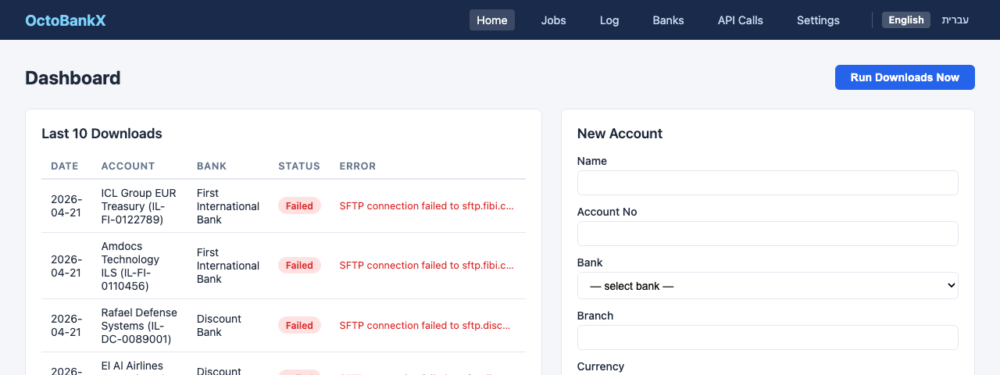

### Last 10 Downloads

The left panel shows the 10 most recent download attempts across all accounts. Each row displays:

| Column | Description |
|--------|-------------|
| **Date** | Date and time the download was attempted |
| **Account** | Account name and identifier |
| **Bank** | The bank this account belongs to |
| **Status** | `success`, `failed`, `running`, or `pending` |
| **Error** | Error message if the download failed |

Status badges are colour-coded: green for success, red for failed, blue for running, and grey for pending.

### Accounts Table

The lower panel lists all registered accounts with their bank, account number, currency, balance, and the date the balance was last updated.

### New Account Form

Use the form on the right to register a new bank account:

1. **Account No** — enter the full account number
2. **Bank** — select the bank from the dropdown (banks must be registered first; see [Banks](#2-banks))
3. **Currency** — three-letter currency code (e.g. `EUR`, `USD`, `ILS`)
4. **Balance** — current opening balance
5. **Balance Date** — the date that balance was recorded
6. **SFTP Username** — the SFTP login username provided by the bank
7. **SFTP Password** — the SFTP password for that account

Click **Create Account** to save.

### Run Downloads Now

The **Run Downloads Now** button (top-right) triggers an immediate download job for today across all accounts, without waiting for the scheduled run.

---

## 2. Banks

The Banks page manages the SFTP connection details for each bank you work with.

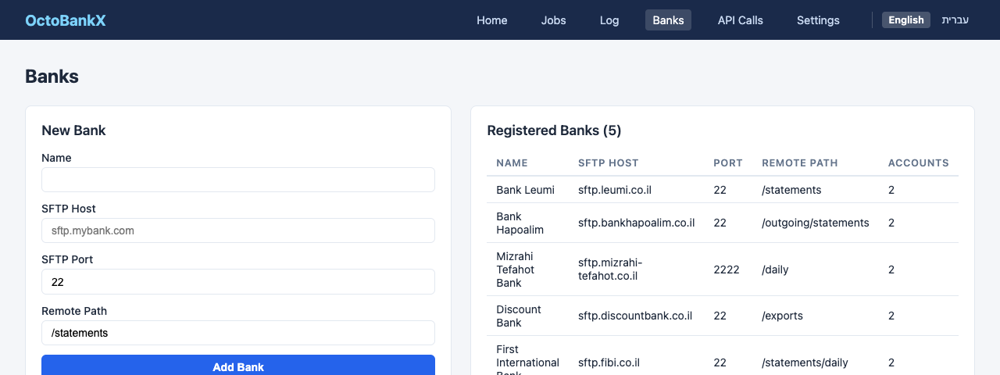

### Registered Banks

The right panel lists all configured banks showing:

| Column | Description |
|--------|-------------|
| **Name** | Display name of the bank |
| **SFTP Host** | Hostname of the bank's SFTP server |
| **Port** | SFTP port (usually `22`) |
| **Remote Path** | Directory on the SFTP server where statements are deposited |
| **Accounts** | Number of accounts registered under this bank |

### Adding a New Bank

Fill in the **New Bank** form on the left:

1. **Name** — a recognisable label for the bank (e.g. `Bank Leumi`)
2. **SFTP Host** — the server hostname (e.g. `sftp.leumi.co.il`)
3. **SFTP Port** — defaults to `22`; change if your bank uses a non-standard port
4. **Remote Path** — the directory path on the SFTP server (e.g. `/statements`)

Click **Add Bank** to save. The new bank will appear immediately in the registered banks list and become available in the account registration dropdown.

---

## 3. Jobs

The Jobs page shows every download job that has been executed or is queued, with filtering options to help you find what you need.

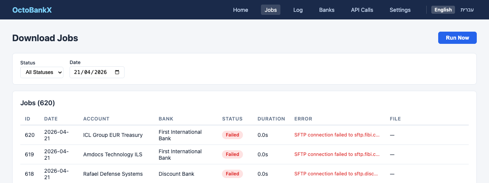

### Filters

At the top of the page you can filter the job list by:

- **Status** — `all`, `success`, `failed`, `running`, or `pending`
- **Date** — narrow results to a specific date

### Job List

Each row in the table represents a single download attempt for one account on one day:

| Column | Description |
|--------|-------------|
| **Date** | The date the job ran |
| **Account** | Account name |
| **Bank** | Bank the account belongs to |
| **Status** | Outcome of the attempt |
| **Error** | Error detail if the job failed |
| **Retries** | How many retry attempts were made |
| **File** | The downloaded filename, if successful |

### Running a Job Manually

Use the **Run Downloads Now** button to trigger an immediate download for all accounts for today's date. The page will refresh and new `running` or `pending` entries will appear.

---

## 4. Log

The Log page is the complete download history — a full audit trail of every statement download ever attempted.

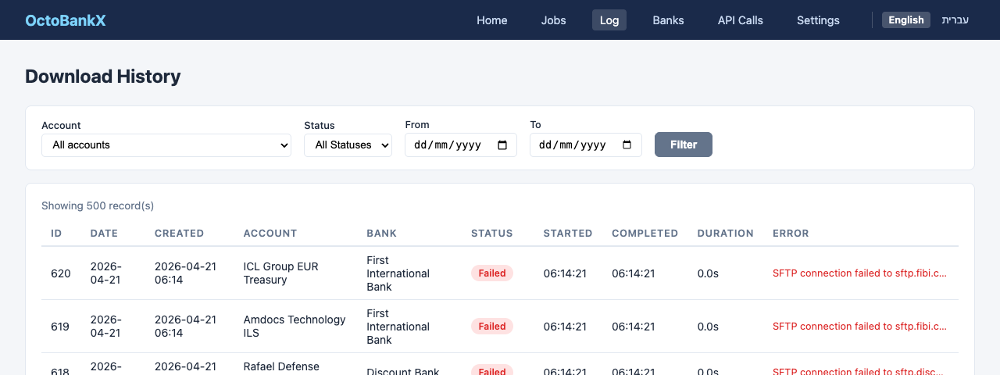

### Filters

The log supports multiple filters that can be combined:

- **Account** — filter by a specific account
- **Bank** — filter by bank
- **Status** — `all`, `success`, `failed`, `running`, `pending`
- **Date From / Date To** — date range selector

### Log Entries

Each entry shows the same fields as the Jobs page. The log is ordered most-recent-first and retains records according to the `retention_days` setting (default: 90 days).

> **Tip:** Use the Log page for auditing and troubleshooting — the Jobs page is focused on today's activity, while the Log covers the full history.

---

## 5. API Calls

The API Calls page records every outbound call made by OctoBankX to external services, useful for debugging integration issues.

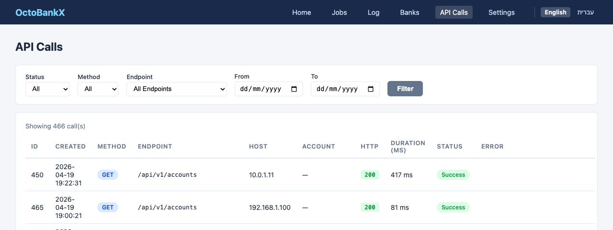

### Filters

- **Status** — filter by HTTP response status or outcome
- **Date** — filter to a specific date

### API Call Entries

| Column | Description |
|--------|-------------|
| **Timestamp** | When the call was made |
| **Endpoint** | The URL or service called |
| **Method** | HTTP method (`GET`, `POST`, etc.) |
| **Status** | HTTP response code |
| **Duration** | How long the call took (ms) |
| **Error** | Error detail if the call failed |

This page helps system administrators diagnose connectivity problems with bank SFTP endpoints or any other integrated service.

---

## 6. Settings

The Settings page controls the system-wide behaviour of OctoBankX.

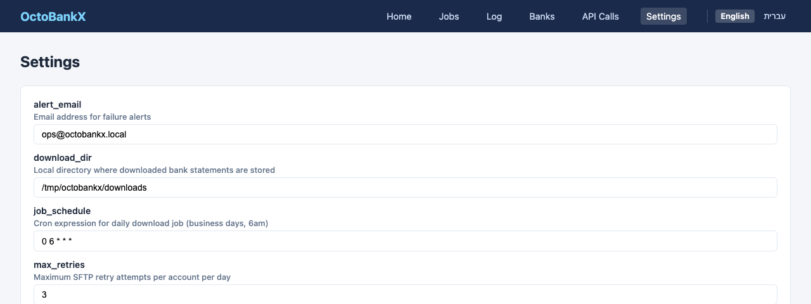

### Configuration Fields

| Setting | Description | Default |
|---------|-------------|---------|
| **alert_email** | Email address that receives failure alerts | `ops@octobankx.local` |
| **download_dir** | Local directory where downloaded statements are stored | `/tmp/octobankx/downloads` |
| **job_schedule** | Cron expression for the automatic daily download job | `0 6 * * *` (6 AM daily) |
| **max_retries** | Maximum SFTP retry attempts per account per day | `3` |
| **notify_on_fail** | Send an alert email when a download fails (`true`/`false`) | `true` |
| **retention_days** | Number of days to keep download history in the database | `90` |
| **sftp_timeout** | SFTP connection timeout in seconds | `30` |

Click **Save Settings** to apply changes. Changes to `job_schedule` take effect on the next scheduled run.

> **Note:** The `download_dir` must be writable by the application process. Ensure the directory exists before saving.

---

## 7. Mobile Interface

OctoBankX includes a fully optimised mobile web interface accessible at `/mobile/`. All the same pages are available through a bottom navigation bar.

### Mobile Dashboard

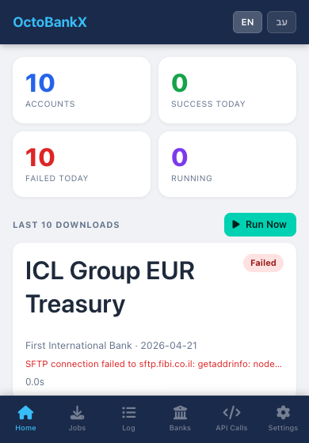

The mobile dashboard shows summary counters at the top (total accounts, active today, failures) followed by a scrollable list of recent downloads — each displayed as a card with the account name, bank, and status badge.

The **+ New Account** button at the bottom opens an inline form to register a new account.

### Mobile Banks

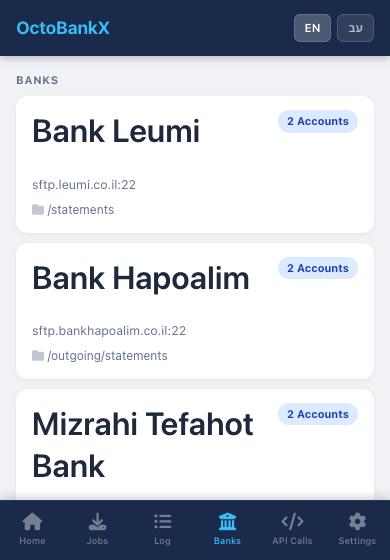

Banks are displayed as cards, each showing the SFTP host, port, remote path, and account count. Tap **+ New Bank** at the bottom to expand the registration form.

### Mobile Jobs

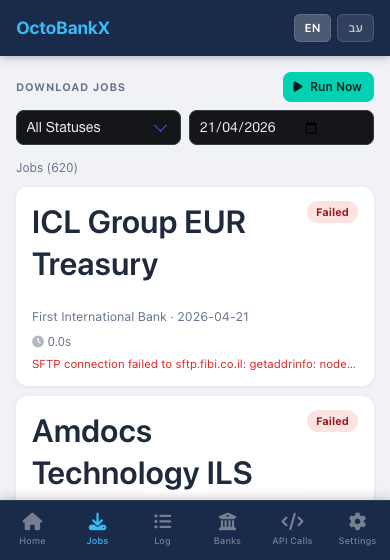

The jobs list adapts to mobile with a compact card layout. Status filters appear as tappable chips at the top. Each card shows the account, bank, date, status, and any error message.

### Mobile Log

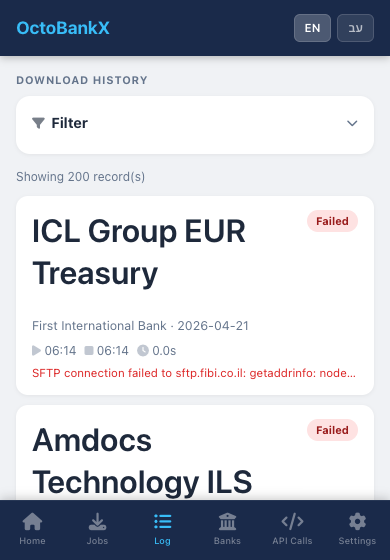

The log on mobile uses the same card layout as Jobs. Filter controls are accessible via a collapsible filter bar at the top.

### Mobile API Calls

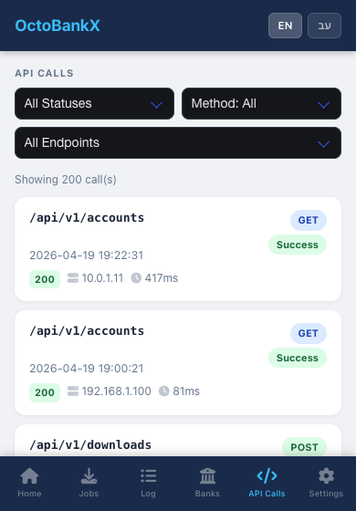

API call history is presented as a scrollable card list, with timestamp, endpoint, status code, and duration visible at a glance.

### Mobile Settings

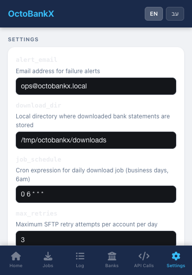

Settings fields are rendered as a dark-themed form. All the same configuration options are available. A **Switch to Desktop Version** link at the bottom navigates to the full desktop interface.

### Language Toggle

On all mobile pages, tap **EN** or **עב** in the top-right corner to switch the interface language between English and Hebrew. The Hebrew interface uses right-to-left (RTL) layout.

---

## 8. Settings Reference

| Setting | Type | Description |
|---------|------|-------------|
| `alert_email` | string (email) | Recipient for all system alert emails |
| `download_dir` | string (path) | Absolute path to the local statements directory |
| `job_schedule` | string (cron) | Standard 5-field cron expression controlling the automatic download schedule |
| `max_retries` | integer | How many times the system retries a failed SFTP connection before marking the job as `failed` |
| `notify_on_fail` | boolean | When `true`, an email is sent to `alert_email` for each failed download |
| `retention_days` | integer | Log records older than this many days are automatically purged |
| `sftp_timeout` | integer | Seconds to wait before aborting an SFTP connection attempt |

---

*OctoBankX © 2026*
