

# OctoBankX — מדריך למשתמש

**כספת** — מערכת אוטומטית להורדת דפי חשבון בנקאיים

OctoBankX מתחברת לבנקים שלך באמצעות SFTP, מורידה אוטומטית דפי חשבון יומיים עבור כל הבנקים המוגדרים, ומספקת מעקב מלא אחר כל ניסיון הורדה. כלול ממשק ווב לשולחן עבודה וממשק מותאם לנייד, עם תמיכה מלאה בעברית (RTL) ובאנגלית.

---

## תוכן עניינים

1. [לוח הבקרה (בית)](#1-לוח-הבקרה-בית)
2. [בנקים](#2-בנקים)
3. [הורדות (משימות)](#3-הורדות-משימות)
4. [לוג (יומן)](#4-לוג-יומן)
5. [הגדרות](#5-הגדרות)
6. [שולחי דוא״ל](#6-שולחי-דואל)
7. [ממשק נייד](#7-ממשק-נייד)
8. [החלפת שפה](#8-החלפת-שפה)
9. [מדריך הגדרות](#9-מדריך-הגדרות)

---

## 1. לוח הבקרה (בית)

לוח הבקרה הוא דף הבית של OctoBankX. הוא מספק סקירה כללית של הפעילות האחרונה, מדדים עיקריים ובריאות המערכת.

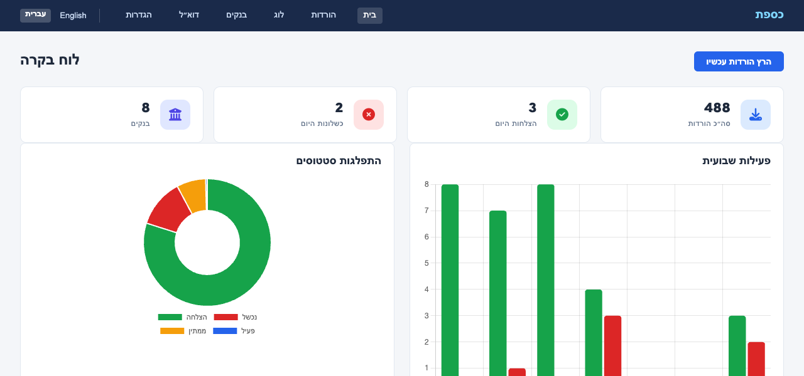

### כרטיסי סיכום

בראש לוח הבקרה, כרטיסי סיכום מציגים את המדדים העיקריים להיום:

| כרטיס | תיאור |
|-------|--------|
| **סה״כ הורדות** | סך כל רשומות ההורדה במערכת |
| **הצלחות היום** | כמה הורדות הושלמו בהצלחה היום |
| **כשלונות היום** | כמה הורדות נכשלו היום |

### תרשימים

- **פעילות שבועית** — תרשים עמודות המציג ספירת הצלחות (ירוק) וכשלונות (אדום) יומיות ל-7 הימים האחרונים
- **התפלגות סטטוסים** — תרשים סופגנייה המציג את ההתפלגות הכוללת של סטטוסי ההורדה (הצלחה, כישלון, ממתין, פעיל)

### 10 ההורדות האחרונות

מתחת לתרשימים, טבלה מציגה את 10 ניסיונות ההורדה האחרונים בכל הבנקים:

| עמודה | תיאור |
|-------|--------|
| **תאריך** | תאריך דף החשבון |
| **בנק** | הבנק אליו שייכת ההורדה |
| **סטטוס** | `הצלחה`, `נכשל`, `פעיל`, או `ממתין` |
| **שגיאה** | הודעת שגיאה אם ההורדה נכשלה |
| **קובץ** | נתיב לקובץ שהורד בהצלחה |
| **התחלה** | מתי החל העברת ה-SFTP |
| **סיום** | מתי הסתיימה ההעברה |

תגי הסטטוס מקודדים בצבע: **ירוק** להצלחה, **אדום** לכישלון, **כחול** לפעיל, ו**אפור** לממתין.

### הפעלת הורדות עכשיו

הכפתור **הרץ הורדות עכשיו** מפעיל משימת הורדה מיידית לכל הבנקים עבור היום, מבלי להמתין להרצה המתוזמנת.

---

## 2. בנקים

דף הבנקים מנהל את פרטי חיבור ה-SFTP ותצורת פענוח הקבצים לכל בנק.

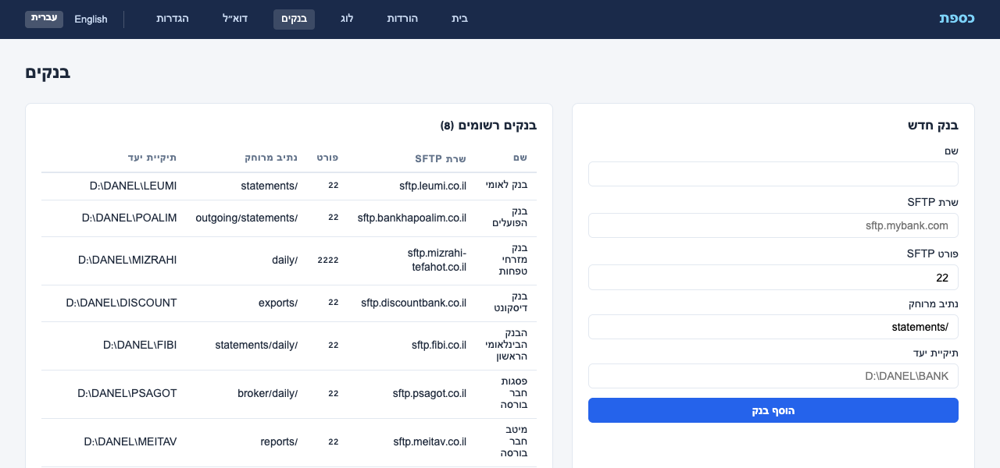

### בנקים רשומים

הפאנל הראשי מפרט את כל הבנקים המוגדרים ומציג:

| עמודה | תיאור |
|-------|--------|
| **שם** | שם הבנק לתצוגה |
| **שרת SFTP** | שם המארח של שרת ה-SFTP של הבנק |
| **פורט** | פורט SFTP (בדרך כלל `22`) |
| **נתיב מרוחק** | התיקייה בשרת ה-SFTP שבה מופקדים דפי החשבון |
| **רולר** | כללי מיפוי עמודות לפענוח קבצי דפי חשבון |
| **מפענח** | כיתת המפענח המוקצית לעיבוד קבצי בנק זה |
| **תיקיית יעד** | תיקייה מקומית שבה נשמרים הקבצים שהורדו |

### הוספת בנק חדש

מלא את טופס **בנק חדש**:

1. **שם** — תווית מזהה לבנק (למשל `בנק לאומי`)
2. **שרת SFTP** — שם המארח של השרת (למשל `sftp.leumi.co.il`)
3. **פורט SFTP** — ברירת מחדל `22`; שנה אם הבנק משתמש בפורט לא סטנדרטי
4. **נתיב מרוחק** — נתיב התיקייה בשרת ה-SFTP (למשל `/statements`)
5. **רולר** — הגדרת מיפוי עמודות לפענוח דפי חשבון
6. **מפענח** — בחר את המפענח המתאים (LeumiParser, PoalimParser, DiscountParser, FibiParser)
7. **תיקיית יעד** — נתיב תיקיית יעד מקומית

לחץ על **הוסף בנק** לשמירה. הבנק החדש יופיע מיד ברשימת הבנקים הרשומים.

---

## 3. הורדות (משימות)

דף ההורדות מציג כל משימת הורדה שבוצעה או נמצאת בתור, עם אפשרויות סינון.

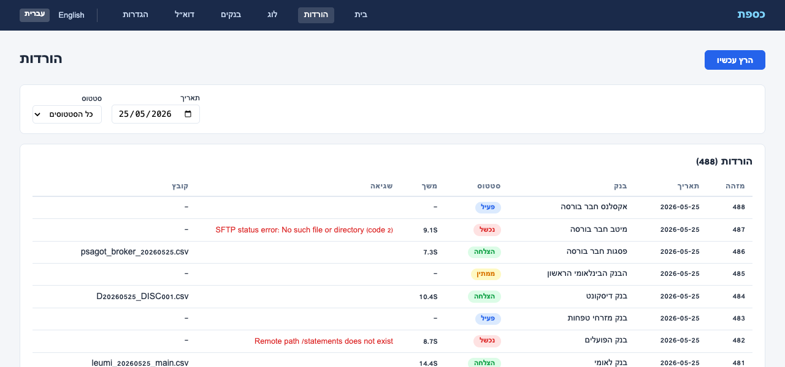

### מסננים

בראש הדף ניתן לסנן את רשימת המשימות לפי:

- **סטטוס** — כל הסטטוסים, הצלחה, נכשל, פעיל, ממתין
- **תאריך** — צמצם תוצאות לתאריך ספציפי

לחץ על **סנן** להחלה.

### רשימת הורדות

כל שורה מייצגת ניסיון הורדה יחיד עבור בנק אחד בתאריך אחד:

| עמודה | תיאור |
|-------|--------|
| **תאריך** | תאריך דף החשבון |
| **בנק** | שם הבנק |
| **סטטוס** | תוצאת הניסיון |
| **שגיאה** | פרטי שגיאה אם המשימה נכשלה |
| **קובץ** | נתיב הקובץ שהורד בהצלחה |
| **התחלה** | מתי החל העברת ה-SFTP |
| **סיום** | מתי הסתיימה ההעברה |

### הפעלת משימה ידנית

השתמש בכפתור **הרץ עכשיו** כדי להפעיל הורדה מיידית לכל הבנקים עבור תאריך היום.

---

## 4. לוג (יומן)

דף הלוג הוא היסטוריית ההורדות המלאה — מסלול ביקורת שלם של כל הורדת דף חשבון שנוסתה אי פעם.

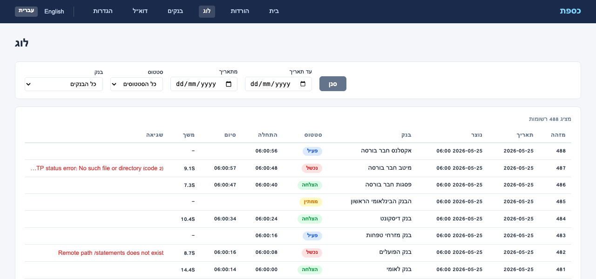

### מסננים

היומן תומך במספר מסננים שניתן לשלב:

- **בנק** — סנן לפי בנק ספציפי (או "כל הבנקים")
- **סטטוס** — כל הסטטוסים, הצלחה, נכשל, פעיל, ממתין
- **מתאריך / עד תאריך** — בורר טווח תאריכים

לחץ על **סנן** להחלה.

### רשומות יומן

כל רשומה מציגה את אותם שדות כמו בדף ההורדות. היומן מסודר מהחדש לישן ושומר רשומות בהתאם להגדרת `retention_days` (ברירת מחדל: 90 יום).

> **טיפ:** השתמש בדף הלוג לצרכי ביקורת ופתרון בעיות — דף ההורדות מתמקד בפעילות היום, בעוד שהלוג מכסה את ההיסטוריה המלאה.

---

## 5. הגדרות

דף ההגדרות שולט בהתנהגות המערכת הכללית של OctoBankX.

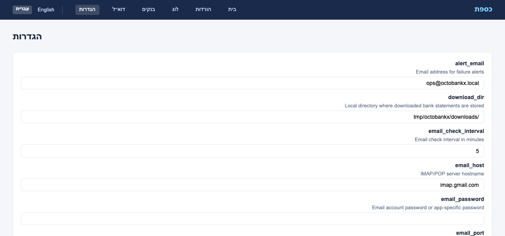

### שדות תצורה

| הגדרה | תיאור | ברירת מחדל |
|-------|--------|------------|
| **alert_email** | כתובת מייל שמקבלת התראות כישלון | `ops@octobankx.local` |
| **download_dir** | תיקייה מקומית שבה נשמרים דפי החשבון שהורדו | `/tmp/octobankx/downloads` |
| **job_schedule** | ביטוי cron למשימת ההורדה היומית האוטומטית | `0 6 * * *` (6:00 בבוקר) |
| **max_retries** | מספר מקסימלי של ניסיונות חוזרים ל-SFTP לבנק ליום | `3` |
| **notify_on_fail** | שליחת מייל התראה כאשר הורדה נכשלת (`true`/`false`) | `true` |
| **retention_days** | מספר הימים לשמירת היסטוריית הורדות במסד הנתונים | `90` |
| **sftp_timeout** | זמן קצוב לחיבור SFTP בשניות | `30` |

לחץ על **שמור הגדרות** להחלת השינויים. שינויים ב-`job_schedule` ייכנסו לתוקף בהרצה המתוזמנת הבאה.

> **שים לב:** `download_dir` חייב להיות ניתן לכתיבה על ידי תהליך האפליקציה. ודא שהתיקייה קיימת לפני השמירה.

---

## 6. שולחי דוא״ל

חלק מהבנקים וחברי הבורסה שולחים קבצי דפי חשבון באמצעות דוא״ל במקום SFTP. כספת כוללת מאזין דוא״ל מובנה שעוקב אחר תיבת דואר ייעודית (למשל `kassefet-server@gmail.com`) באמצעות IMAP או POP3, ומוריד אוטומטית קבצים מצורפים משולחים מאושרים.

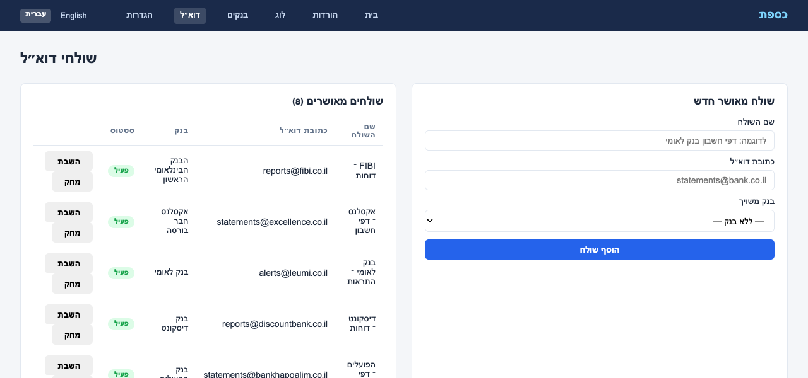

### שולחים מאושרים

דף שולחי הדוא״ל מציג את כל כתובות הדוא״ל המאושרות בטבלה:

| עמודה | תיאור |
|-------|--------|
| **שם השולח** | תווית תיאורית (למשל "בנק לאומי – דפי חשבון") |
| **כתובת דוא״ל** | כתובת הדוא״ל שהמערכת מקבלת ממנה קבצים |
| **בנק** | הבנק אליו משויך השולח — קבצים מצורפים מתויקים תחת בנק זה |
| **סטטוס** | `פעיל` (ירוק) או `לא פעיל` (אפור) |

רק מיילים משולחים מאושרים **פעילים** מעובדים. כל שאר המיילים מתעלמים.

### הוספת שולח חדש

מלא את טופס **שולח מאושר חדש**:

1. **שם השולח** — תווית תיאורית לשולח זה
2. **כתובת דוא״ל** — כתובת הדוא״ל המדויקת שהבנק משתמש בה לשליחת קבצים
3. **בנק משויך** — בחר לאיזה בנק שייך שולח זה

לחץ על **הוסף שולח** לשמירה.

### ניהול שולחים

- **השבתה / הפעלה** — הפעלה וכיבוי של שולח מבלי למחוק אותו
- **מחיקה** — הסרה לצמיתות של שולח מרשימת המאושרים

### הגדרת דוא״ל

הגדרות חיבור הדוא״ל מנוהלות בדף **הגדרות**:

| הגדרה | תיאור |
|-------|--------|
| `email_protocol` | `imap` או `pop` |
| `email_host` | שם מארח שרת הדואר (למשל `imap.gmail.com`) |
| `email_port` | פורט השרת (למשל `993` ל-IMAP SSL) |
| `email_username` | שם משתמש חשבון הדוא״ל |
| `email_password` | סיסמת חשבון דוא״ל או סיסמה ייעודית לאפליקציה |
| `email_ssl` | שימוש ב-SSL/TLS (`true` / `false`) |
| `email_check_interval` | תדירות בדיקת מיילים חדשים (בדקות) |

### איך זה עובד

1. משימת מאזין הדוא״ל רצה בתדירות המוגדרת
2. מתחברת לתיבת הדואר באמצעות הגדרות IMAP או POP3
3. לכל מייל שלא נקרא, בודקת האם השולח נמצא ברשימת המאושרים
4. אם מאושר, כל הקבצים המצורפים מסוג CSV/Excel/ZIP נשמרים בתיקיית ההורדות של הבנק
5. רשומת הורדה נוצרת עם סטטוס `הצלחה`
6. המייל מסומן כנקרא (IMAP) או נמחק (POP3)

---

## 7. ממשק נייד

OctoBankX כולל ממשק ווב נייד מותאם לחלוטין הנגיש בכתובת `/mobile/`. כל הדפים זמינים דרך סרגל ניווט תחתון.

### לוח בקרה נייד

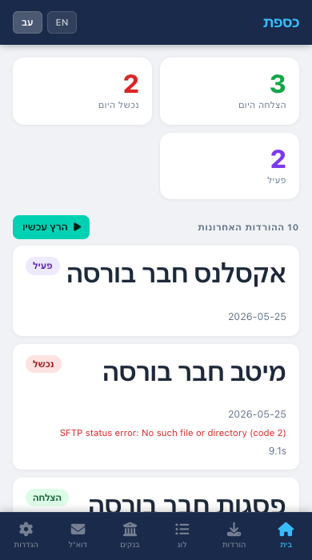

לוח הבקרה הנייד מציג מונים מסכמים בראש (הצלחות היום, כשלונות היום, פעיל) ולאחר מכן רשימה גלילה של הורדות אחרונות — כל אחת מוצגת ככרטיס עם שם הבנק ותג הסטטוס.

### בנקים בנייד

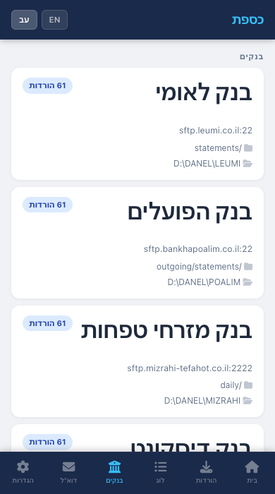

הבנקים מוצגים כקלפים, כל אחד מציג את מארח ה-SFTP, הפורט, הנתיב המרוחק, הרולר, המפענח ותיקיית היעד. הקש על **בנק חדש** בראש להרחבת טופס הרישום.

### הורדות בנייד

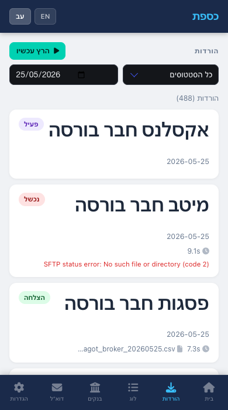

רשימת ההורדות מותאמת לנייד עם פריסת קלפים קומפקטית. מסנני תאריך וסטטוס מופיעים בראש. כל קלף מציג את הבנק, התאריך, הסטטוס וכל הודעת שגיאה.

### לוג בנייד

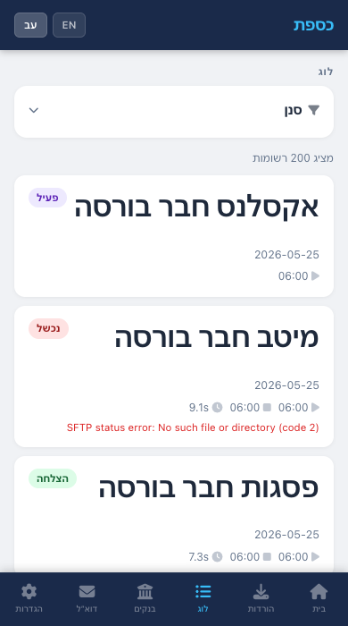

הלוג בנייד משתמש באותה פריסת קלפים כמו ההורדות. פקדי סינון (בנק, סטטוס, טווח תאריכים) נגישים בראש.

### הגדרות בנייד

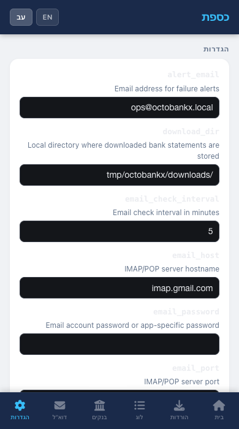

שדות ההגדרות מוצגים כטופס מותאם לנייד עם כל אפשרויות התצורה. קישור **עבור לגרסת מחשב** בתחתית מנווט לממשק שולחן העבודה המלא.

### שולחי דוא״ל בנייד

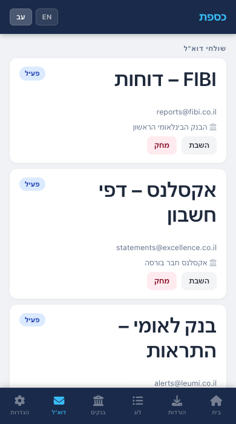

שולחי הדוא״ל מוצגים כקלפים, כל אחד מציג את שם השולח, כתובת הדוא״ל, הבנק המשויך ותג סטטוס. הקש על הכפתורים להפעלה/השבתה או מחיקה של שולח. טופס להוספת שולחים מאושרים חדשים זמין בתחתית.

---

## 8. החלפת שפה

OctoBankX תומכת ב**אנגלית** וב**עברית**. מתג השפה מופיע בסרגל הניווט בממשק השולחן עבודה ובממשק הנייד.

- לחץ על **English** או **עברית** בסרגל הניווט העליון להחלפת שפה
- ממשק העברית מחיל אוטומטית פריסה מימין לשמאל (RTL)
- העדפת השפה שלך נשמרת בסשן ונשמרת בין ניווטים בין דפים

---

## 9. מדריך הגדרות

| הגדרה | סוג | תיאור |
|-------|-----|--------|
| `alert_email` | מחרוזת (אימייל) | נמען לכל מיילי התראות המערכת |
| `download_dir` | מחרוזת (נתיב) | נתיב מוחלט לתיקיית דפי החשבון המקומית |
| `email_check_interval` | מספר שלם | דקות בין בדיקות תיבת דואר |
| `email_host` | מחרוזת | שם מארח שרת IMAP/POP3 |
| `email_password` | מחרוזת | סיסמת חשבון דוא״ל או סיסמה ייעודית לאפליקציה |
| `email_port` | מספר שלם | פורט שרת IMAP/POP3 |
| `email_protocol` | מחרוזת | `imap` או `pop` |
| `email_ssl` | בוליאני | שימוש ב-SSL/TLS לחיבור דוא״ל |
| `email_username` | מחרוזת (אימייל) | שם משתמש חשבון דוא״ל |
| `job_schedule` | מחרוזת (cron) | ביטוי cron סטנדרטי בן 5 שדות השולט בלוח הזמנים של ההורדה האוטומטית |
| `max_retries` | מספר שלם | כמה פעמים המערכת מנסה שוב חיבור SFTP שנכשל לפני שמסמנת את המשימה כ-`failed` |
| `notify_on_fail` | בוליאני | כאשר `true`, נשלח מייל ל-`alert_email` עבור כל הורדה שנכשלה |
| `retention_days` | מספר שלם | רשומות יומן ישנות יותר ממספר זה של ימים נמחקות אוטומטית |
| `sftp_timeout` | מספר שלם | שניות להמתנה לפני ביטול ניסיון חיבור SFTP |

---

*OctoBankX © 2026*

